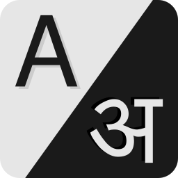

    

# Open Translations

Free, open-source and verified translations for your websites, apps and other 
software.

---

## Why?

Translating (or internationalising) a piece of software is not an easy task. 
Using translation tools, such as Google Translate, is neither productive nor 
accurate.

A single word can have multiple meanings, so a translation tool will show you 
many translations. This makes it difficult to choose the correct translation
for our intended usage and context.

Another problem is that some English words&mdash;such as "App", "Login"&mdash;are 
used as-it-is in many countries and languages. So, it makes little sense to 
translate them.

Open Translations is an open-source project with the aim to make i18n easy by
translating all the common phrases and terminology used in websites, apps and 
other software into various languages.
